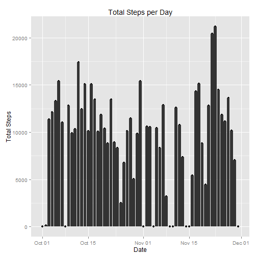
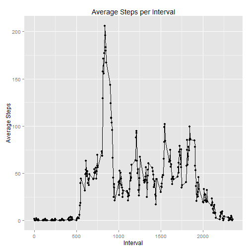
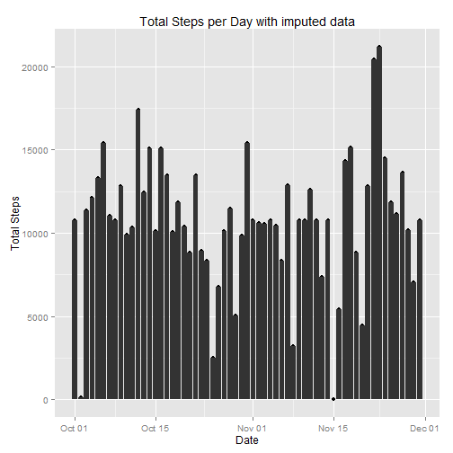
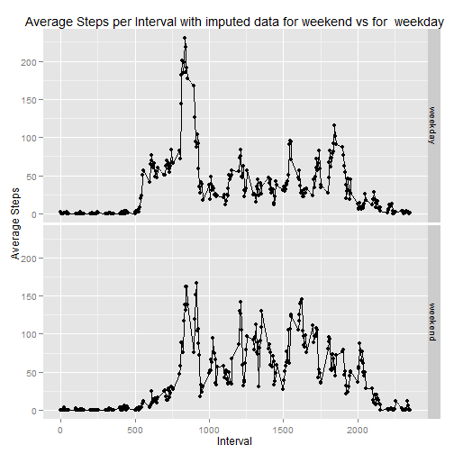
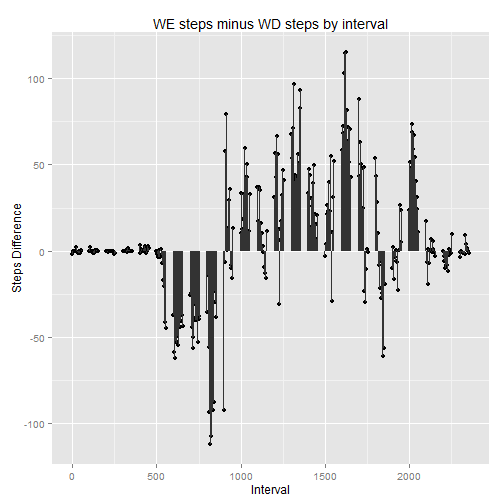

# Reproducible Research: Peer Assessment 1


## Loading and preprocessing the data
The following code is used to load the data. I assume that zipped datafile is available and in the same directory as the source `.Rmd` file for this document (as the zip is provided part of the assignment repository). I use the `data.table` library and `fread()` as I find this easier in general.  The only preprocessing required is interpreting the second column of character vectors as instances of class `Date` using `as.Date()`.

```r
require(data.table)
```

```
## Loading required package: data.table
```

```r
dataFile <-"./activity.csv"
zipFile <- "./activity.zip"
unzip(zipFile)
activity <- fread(dataFile)
activity$date<-as.Date(activity$date)
```


## What is mean total number of steps taken per day?
To facilatate computation of the total steps per day (as well as other computations later in this document), I use the package `pylr` and its `ddply` method.  The package `ggplot2` is used for all plots in this document.

```r
require(plyr)
```

```
## Loading required package: plyr
```

```r
require(ggplot2)
```

```
## Loading required package: ggplot2
```

```r
# Divide the data along the date and compute the sum of steps across the 
# intervals for that day.  Note that to produce meaningful results, NA values
# must be excluded.
dailySteps  <- ddply(
    activity,
    .(date),
    function(df) c("totalSteps" = sum(df$steps, na.rm=TRUE))
  )

plot <- qplot(
    date, 
    totalSteps, 
    data = dailySteps, 
    main="Total Steps per Day", xlab="Date", ylab="Total Steps"
  ) 
plot + geom_histogram(stat = "identity", aes(date, totalSteps))
```

 

The mean number of steps per day is 9354, and the median number of steps per day is 10395.


## What is the average daily activity pattern?

```r
# Divide the data along the intervals and compute the sum of mean steps across 
# all days for that interval.  Note again the need to exclude NAs to produce 
# meaningful results.
dayAverage <- ddply(
    activity,
    .(interval),
    function(df) c("meanSteps" = mean(df$steps, na.rm = TRUE))
  )

plot <- qplot(
    interval, 
    meanSteps, 
    data = dayAverage,
    main="Average Steps per Interval", xlab="Interval", ylab="Average Steps"
  )
plot + geom_line(aes(x = interval, y = meanSteps))
```

 

The interval with the most steps on an average day is interval with value 835 (that is, the 5 minute interval begining at the time of that value interpreted as hours and minutes after midnight where midnight is `0`).


## Imputing missing values
There are 2304 rows with missing values.  All missing values are for the variable `steps` in the source data (and 0 for `date` and `interval`).

To impute the missing values, I use the average daily value of `steps` for the interval in question.  That is, if the first interval is NA for day 2012-10-1 (in this dataset,

```r
(activity[1,]$interval == 0) & (activity[1,]$date == "2012-10-01") & is.na(activity[1,]$steps)
```

```
## [1] TRUE
```
), then I use the previously computed average activity for that interval (`dayAverage[dayAverage$interval == i,]$meanSteps` where `i == activity[1,]$interval`) as the imputed value.

```r
# first copy the original data
imputed <- activity
# for consistency with the computed means, reinterpret the steps as numeric 
# rather than int
imputed$steps <- as.numeric(imputed$steps)
# for each row with NA for steps, insert the calculated meaan for that interval
# across the rest of the days.
for ( i in seq_along(imputed$steps)) {
  if (is.na(imputed[i]$steps)) {
    imputed[i]$steps <- dayAverage[
        dayAverage$interval==imputed[i,]$interval,
      ]$meanSteps
  }
}

# Demonstrating the only changes between the original data and imputed data are
# the removed "NA" rows and the resultant quanitile distribution of the steps 
# values.
summary(activity)
```

```
##      steps            date               interval   
##  Min.   :  0.0   Min.   :2012-10-01   Min.   :   0  
##  1st Qu.:  0.0   1st Qu.:2012-10-16   1st Qu.: 589  
##  Median :  0.0   Median :2012-10-31   Median :1178  
##  Mean   : 37.4   Mean   :2012-10-31   Mean   :1178  
##  3rd Qu.: 12.0   3rd Qu.:2012-11-15   3rd Qu.:1766  
##  Max.   :806.0   Max.   :2012-11-30   Max.   :2355  
##  NA's   :2304
```

```r
summary (imputed)
```

```
##      steps            date               interval   
##  Min.   :  0.0   Min.   :2012-10-01   Min.   :   0  
##  1st Qu.:  0.0   1st Qu.:2012-10-16   1st Qu.: 589  
##  Median :  0.0   Median :2012-10-31   Median :1178  
##  Mean   : 37.4   Mean   :2012-10-31   Mean   :1178  
##  3rd Qu.: 27.0   3rd Qu.:2012-11-15   3rd Qu.:1766  
##  Max.   :806.0   Max.   :2012-11-30   Max.   :2355
```

```r
# Divide the imputed data along the date and compute the sum of steps across the 
# intervals for that day.  Note that it is not necessary to ignore NAs in this
# computation.
imputedDailySteps  <- ddply(
    imputed,
    .(date),
    function(df) c("totalSteps" = sum(df$steps))
  )

plot <- qplot(
    date, 
    totalSteps, 
    data = imputedDailySteps,
    main="Total Steps per Day with imputed data", xlab="Date", ylab="Total Steps"
  ) 
plot + geom_histogram(stat = "identity", aes(x = date, y = totalSteps))
```

 

The imputed mean number of steps per day is 10766, and the imputed median number of steps per day is 10766.

## Are there differences in activity patterns between weekdays and weekends?
To compare weekday and weekend behavior, I add a column to the imputed data which is a factor of `"weekend"` or `"weekday"` based on whether `weekdays(imputed$date)` is one of `"Saturday"` or `"Sunday"`.  

```r
satSun <- c("Saturday","Sunday")

weekends<-weekdays(imputed$date)%in%satSun
dayType <- ifelse(weekends,"weekend", "weekday")
imputed<-cbind(imputed,dayType)
imputed$dayType <- as.factor(imputed$dayType)

# Divide the data along the combination of dayType and interval and compute the
# mean number of steps for the interval for the dayType. There are no NAs in 
# this data (by construction) so na.rm = TRUE is not required.
imputedDayTypeAverage <- ddply(
    imputed,
    .(dayType, interval),
    function(df) c("meanSteps" = mean(df$steps))
  )


qplot(
    interval,  
    meanSteps,  
    data  =  imputedDayTypeAverage,	
    facets	=	dayType	~	.,
    main="Average Steps per Interval with imputed data for weekend vs for  weekday", xlab="Interval", ylab="Average Steps"
  )	+ geom_line(aes(x = interval, y = meanSteps))
```

 
Note that the warning generated by ggplot2 is anticipated and irrelevant to our purposes here. 

As can be seen comparing these two plots, test subject activity is more evenly distributed on weekends than weekdays, with weekdays showing a pronounced spike between approximately 8 AM and 9 AM.  These line graphs do not make the total difference between weekend days and weekdays immediately apparent. Just for fun, let's examine the difference between weekday and weekend behavior a bit more.  Let's subtract weekday steps per interval from weekend steps per interval and plot the results.

```r
WEminusWD <- ddply(
    imputedDayTypeAverage,
    .(interval),
    function(df) c(
      "difference" = df[df$dayType=="weekend",]$meanSteps 
        - df[df$dayType=="weekday",]$meanSteps)
  )

plot <- qplot(
    interval, 
    difference, 
    data = WEminusWD,
    main="WE steps minus WD steps by interval", xlab="Interval", ylab="Steps Difference"
  ) 
plot + geom_histogram(stat = "identity")
```

```
## Warning: Stacking not well defined when ymin != 0
```

 

From this plot, it is more apparent that the weekends are more active than weekdays, though significant activity starts later in the day.  In terms of total steps, on average a weekend has 1945.6762 more steps, or a ratio of 1.1897 for steps on a Saturday or Sunday to steps on a weekday.

